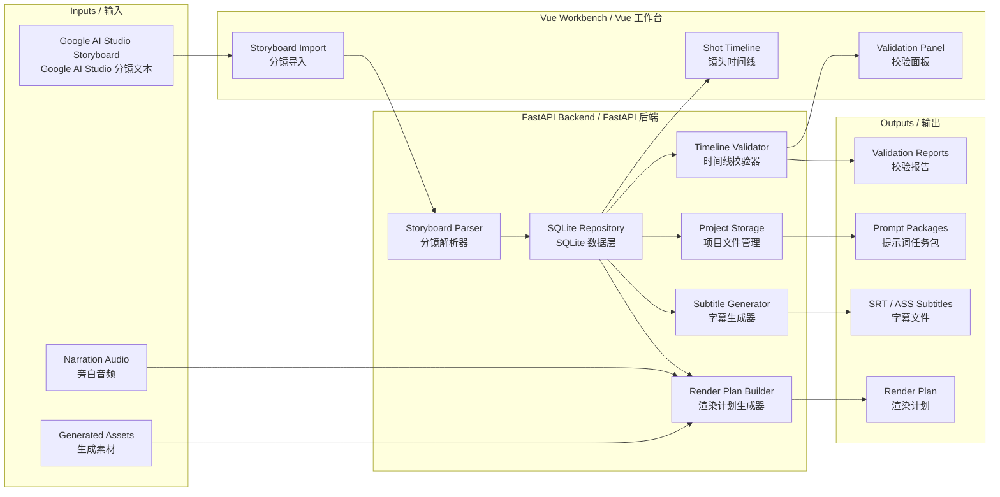

> 🚧 Project Status: v1.0.0-beta.1 / Beta Hardening Sprint 2
>
> Readiness Score: 84/100
>
> Current features:
> - Storyboard management
> - Shot management
> - Asset binding
> - Asset preview
> - Asset upload
> - Nano Banana image and keyframe generation
> - Jimeng video generation and REST job workflow
> - Timeline editor
> - Render plan export
> - CI/CD pipeline
# AI Video Workbench / AI 短视频生产工作台

AI Video Workbench is a local production cockpit for turning AI-generated storyboard scripts into structured, trackable, and render-ready short-video projects.

AI 短视频生产工作台是一个本地化生产驾驶舱，用于把 AI 生成的分镜脚本文本转化为结构化、可追踪、可校验、可进入渲染流程的短视频项目。

---

## 1. Project Overview / 项目简介

This project helps scale an AI short-video workflow that typically involves:

1. Generating scripts and storyboards in Google AI Studio.
2. Creating narration audio with ElevenLabs or another voice tool.
3. Generating images with Nano banana.
4. Generating I2V clips with Jimeng.
5. Aligning images, videos, audio, and subtitles into a final video.

本项目用于规模化一个典型 AI 短视频流程：

1. 在 Google AI Studio 生成脚本和分镜。
2. 使用 ElevenLabs 或其他语音工具生成旁白音频。
3. 使用 Nano banana 生成图片。
4. 使用即梦生成图生视频片段。
5. 将图片、视频、音频和字幕严格对齐，组合成最终成片。

v1.0.0-beta.1 focuses on a stable local workbench foundation: parsing fixed-format storyboard text, managing shot metadata, uploading and binding assets, configuring providers, generating image/keyframe/video assets through existing providers, validating timelines, generating subtitles, and preparing render plans.

v1.0.0-beta.1 聚焦稳定的本地工作台基础能力：解析固定格式分镜文本、管理镜头元数据、上传和绑定素材、配置 Provider、通过现有 Provider 生成图片/关键帧/视频素材、校验时间线、生成字幕，并准备渲染计划。

---

## 2. Core Features / 核心功能

- **Storyboard parsing**: Parse Google AI Studio planning metadata, batch text, and shot-level prompts.
- **Shot classification**: Identify Mode A overlays, Mode B new compositions, and key-node I2V shots.
- **Prompt package export**: Generate task files for Nano banana images, Nano banana keyframes, and Jimeng I2V prompts.
- **Asset tracking foundation**: Store expected image, keyframe, and video paths per shot.
- **Timeline validation**: Detect time gaps, overlaps, duplicate shot IDs, invalid durations, missing assets, and audio timeline mismatches.
- **Subtitle generation**: Generate Chinese SRT and bilingual ASS subtitles.
- **Render plan generation**: Build a structured render plan for image-to-video and video normalization steps.
- **Workbench UI**: Provide a local `/video-workbench` page for importing storyboard text, viewing shot cards, and checking validation status.

- **分镜解析**：解析 Google AI Studio 的规划信息、批次文本和镜头级提示词。
- **镜头分类**：识别模式 A 垫图叠加、模式 B 全新构图，以及关键节点 I2V 镜头。
- **提示词包导出**：生成 Nano banana 图片、Nano banana 关键帧、即梦 I2V 的任务文件。
- **素材追踪基础**：为每个镜头记录预期图片、关键帧和视频路径。
- **时间线校验**：检测时间断档、重叠、重复镜头编号、非法时长、缺失素材和音频时间轴不匹配。
- **字幕生成**：生成中文字幕 SRT 和中英双语 ASS 字幕。
- **渲染计划生成**：为图片转视频和视频时长标准化生成结构化渲染计划。
- **工作台 UI**：提供本地 `/video-workbench` 页面，用于导入分镜文本、查看镜头卡片和校验状态。

---

## 3. Technical Architecture / 技术架构图



---

## 4. Local Development / 本地启动方法

### 5-Minute Quickstart / 5 分钟上手

Clone / 克隆：

```bash
git clone https://github.com/JUJING-DEEP/ai-video-workbench.git
cd ai-video-workbench
```

Backend install / 安装后端：

```bash
cd backend
python -m pip install -r requirements.txt
```

Frontend install / 安装前端：

```bash
cd ../frontend
npm ci
```

Run backend / 启动后端：

```bash
cd ../backend
uvicorn app.main:app --reload --port 8000
```

Run frontend / 启动前端：

```bash
cd ../frontend
npm run dev -- --host 127.0.0.1
```

Open / 打开：

```text
http://127.0.0.1:5173/video-workbench
```

First workflow / 第一次完整流程：

1. Open **Provider Settings**.
2. Configure Provider:
   - Nano Banana: enter API key and Base URL.
   - Jimeng: enter Base URL or REST fields, including access key, secret key, endpoint, model, and enabled state.
3. Create Project using the project bar.
4. Import Storyboard to create Shot records. Use this minimal sample:

```text
第 1 张图片 ▏时间：0:00 — 0:02 ▏模式：B（全新构图）
台词：你好 / Hello
--- 提示词 ---
Scene: Test shot.
```

5. Select the Shot in the timeline.
6. Generate Keyframe from the AI Keyframe Generator.
7. Generate Video from the Video Generator, or submit and poll a Jimeng REST job.
8. Generate Render Plan in the Render Pipeline panel.
9. Export Render Plan.

Generated files are written under `data/uploads/{project_id}/...` and `data/exports/{project_id}/render-plan.json`.

### Prerequisites / 环境要求

- Python 3.11 recommended; CI currently tests Python 3.11
- Node.js 20 recommended; CI currently tests Node 20
- npm
- FFmpeg and ffprobe, required for later media probing/rendering workflows

- 推荐 Python 3.11；CI 当前使用 Python 3.11
- 推荐 Node.js 20；CI 当前使用 Node 20
- npm
- FFmpeg 和 ffprobe，后续媒体探测与渲染流程会用到

### Backend / 后端

```bash
cd backend
python -m pip install -r requirements.txt
uvicorn app.main:app --reload --port 8000
```

Health check / 健康检查：

```bash
curl http://127.0.0.1:8000/api/video-workbench/health
```

Expected response / 预期返回：

```json
{
  "success": true,
  "data": {
    "status": "ok"
  }
}
```

### Frontend / 前端

```bash
cd frontend
npm ci
npm run dev -- --host 127.0.0.1
```

Open / 打开：

```text
http://127.0.0.1:5173/video-workbench
```

### Tests / 测试

```bash
cd backend
python -m pytest tests/video_workbench -v
```

```bash
cd frontend
npm run test
npm run build
npm run lint
```

Backend lint / 后端 lint：

```bash
cd backend
ruff check .
```

---

## 5. API Reference / API 说明

### `GET /api/video-workbench/health`

Checks whether the video workbench API is available.

检查短视频工作台 API 是否可用。

Response / 返回：

```json
{
  "success": true,
  "data": {
    "status": "ok"
  }
}
```

All API responses use a standard envelope.

所有 API 响应均使用统一 envelope。

Successful response / 成功响应：

```json
{
  "success": true,
  "data": {}
}
```

Error response / 错误响应：

```json
{
  "success": false,
  "error": {
    "code": "bad_request",
    "message": "Human-readable error message."
  }
}
```

### `POST /api/video-workbench/parse`

Parses fixed-format Google AI Studio storyboard text into planning metadata and shot records.

将固定格式的 Google AI Studio 分镜文本解析为项目规划信息和镜头记录。

Request / 请求：

```json
{
  "text": "第 1 张图片 ▏时间：0:00 — 0:02 ▏模式：B（全新构图）\n台词：你好 / Hello\n--- 提示词 ---\nScene: Test"
}
```

Response / 返回：

```json
{
  "success": true,
  "data": {
    "planning": {
      "audio_duration_seconds": null,
      "estimated_regular_images": null,
      "estimated_key_nodes": null,
      "estimated_batches": null,
      "batch_size": null
    },
    "shots": [
      {
        "shot_id": 1,
        "start_seconds": 0.0,
        "end_seconds": 2.0,
        "duration_seconds": 2.0,
        "kind": "image",
        "mode": "B",
        "dialogue_zh": "你好",
        "dialogue_en": "Hello",
        "image_prompt": "Scene: Test",
        "i2v_prompt": "",
        "status": "parsed"
      }
    ]
  }
}
```

Invalid storyboard-like text returns `400 Bad Request` with `success: false` and `error.message`.

格式异常的分镜文本会返回 `400 Bad Request`，并通过 `success: false` 和 `error.message` 返回可读的错误说明。

### Provider Settings Public Schema / Provider Settings 公开 Schema

Nano Banana and Jimeng settings share the same non-secret response shape.

Nano Banana 和 Jimeng settings 使用统一的非密钥响应结构。

```json
{
  "success": true,
  "data": {
    "settings": {
      "provider": "jimeng",
      "configured": true,
      "enabled": true,
      "credentials": {
        "api_key": true,
        "access_key": true,
        "secret_key": true
      },
      "base_url": "https://jimeng.example/generate",
      "region": "cn-north-1",
      "endpoint": "https://open.volcengineapi.com",
      "model": "jimeng-v3",
      "updated_at": "2026-06-19 08:00:00"
    }
  }
}
```

Credential values can be submitted with `api_key`, `access_key`, and `secret_key`, but credential values are never returned.

---

## 6. Project Structure / 项目目录结构

```text
.
├── backend/
│   ├── app/
│   │   ├── main.py
│   │   └── video_workbench/
│   │       ├── api.py
│   │       ├── media_probe.py
│   │       ├── models.py
│   │       ├── parser.py
│   │       ├── render_plan.py
│   │       ├── repository.py
│   │       ├── storage.py
│   │       ├── subtitles.py
│   │       ├── timecode.py
│   │       └── validator.py
│   ├── tests/
│   │   └── video_workbench/
│   └── requirements.txt
├── frontend/
│   ├── src/
│   │   ├── components/
│   │   │   └── video-workbench/
│   │   │       ├── AssetLibraryPanel.vue
│   │   │       ├── ProviderSettingsPanel.vue
│   │   │       ├── RenderPipelinePanel.vue
│   │   │       ├── ShotTimeline.vue
│   │   │       ├── TimelinePanel.vue
│   │   │       ├── VideoJobPanel.vue
│   │   │       └── ValidationPanel.vue
│   │   ├── services/
│   │   │   └── videoWorkbenchApi.js
│   │   ├── views/
│   │   │   └── VideoWorkbench.vue
│   │   └── router/
│   │       └── index.js
│   ├── package.json
│   └── vite.config.js
├── docs/
│   ├── demo-project.md
│   ├── plans/
│   └── specs/
├── SPEC.md
└── README.md
```

Planned generated project storage / 计划中的生成项目存储结构：

```text
video_projects/
  sleep-video-001/
    project.json
    shots.json
    audio/
    prompts/
      nano_images/
      nano_keyframes/
      jimeng_i2v/
    assets/
      images/
      keyframes/
      videos/
    subtitles/
    renders/
    reports/
```

---

## 7. v1.0.0-beta.1 Implemented / v1.0.0-beta.1 已实现功能

- Backend test harness with pytest.
- Domain models for projects, shots, shot modes, shot kinds, and statuses.
- Timecode parsing and formatting with boundary validation.
- Storyboard parser for project planning metadata, Mode A, Mode B, and key-node I2V blocks.
- SQLite repository for video projects and shots.
- Asset upload, asset library, and image/keyframe/video binding.
- Provider settings for Nano Banana and Jimeng with credential redaction.
- Nano Banana image and keyframe generation endpoints.
- Mock and Jimeng video generation endpoints.
- Jimeng REST video job submit/poll workflow.
- Safe local project storage and prompt package export.
- Timeline validator for gaps, overlaps, missing assets, invalid durations, duplicate shot IDs, and audio mismatch.
- SRT and ASS subtitle generation with ASS escaping and deterministic ordering.
- Render-plan builder with missing asset and duplicate ID protection.
- FFprobe duration wrapper with path-aware errors.
- Standard FastAPI response envelope for success and error responses.
- FastAPI routes for project, storyboard, asset, provider, generation, timeline, and render-plan workflows.
- Vue workbench route at `/video-workbench`.
- Refactored Vue panels for provider settings, shot timeline, validation, render pipeline, timeline editing, and video jobs.
- Ruff and ESLint lint gates in CI.
- Automated backend and frontend tests.

- 后端 pytest 测试基础设施。
- 项目、镜头、镜头模式、镜头类型和状态领域模型。
- 带边界校验的时间码解析与格式化。
- 支持项目规划信息、模式 A、模式 B、关键节点 I2V 文本块的分镜解析器。
- 用于视频项目和镜头数据的 SQLite repository。
- 素材上传、素材库，以及图片/关键帧/视频绑定。
- Nano Banana 和即梦 Provider Settings，密钥不会回传。
- Nano Banana 图片和关键帧生成接口。
- Mock 和即梦视频生成接口。
- 即梦 REST 视频任务提交/轮询流程。
- 安全的本地项目存储和提示词包导出。
- 时间线校验器，可检测断档、重叠、缺失素材、非法时长、重复镜头编号和音频不匹配。
- SRT 和 ASS 字幕生成，包含 ASS 转义和稳定排序。
- 渲染计划生成器，包含缺失素材和重复 ID 防护。
- 带路径上下文错误信息的 FFprobe 时长探测封装。
- 成功和错误响应统一的 FastAPI response envelope。
- 覆盖项目、分镜、素材、Provider、生成、Timeline、Render Plan 工作流的 FastAPI 接口。
- Vue 工作台页面 `/video-workbench`。
- 已拆分的 Vue 面板组件：Provider Settings、镜头时间线、校验、Render Pipeline、Timeline 编辑、Video Job。
- CI 中的 Ruff 和 ESLint lint gate。
- 后端与前端自动化测试。

Verification completed / 已完成验证：

```bash
cd backend && python -m pytest tests/video_workbench -v
cd frontend && npm run test
cd frontend && npm run build
ruff check .
cd frontend && npm run lint
```

---

## 8. Phase 2 Roadmap / Phase 2 路线图

### AI Studio Agent

- Open the current Google AI Studio conversation.
- Detect completed storyboard batches.
- Capture and append new batch text.
- Send continuation commands such as `继续` or `生成分镜`.
- Pause for malformed output, duplicate ranges, missing ranges, login issues, or account limits.

- 打开当前 Google AI Studio 对话。
- 检测已完成的分镜批次。
- 抓取并追加新批次文本。
- 发送 `继续` 或 `生成分镜` 等续写指令。
- 遇到格式异常、重复范围、缺失范围、登录问题或账号限制时暂停。

### Nano banana Agent

- Execute Mode B image-generation tasks.
- Execute Mode A base-image overlay/edit tasks.
- Generate keyframes for key-node video shots.
- Download and bind generated assets to shot IDs.
- Pause for login, captcha, quota, failed generation, or manual review.

- 执行模式 B 图片生成任务。
- 执行模式 A 底图叠加/编辑任务。
- 为关键节点视频镜头生成关键帧。
- 下载生成素材并绑定到镜头 ID。
- 遇到登录、验证码、额度、生成失败或人工审核时暂停。

### Jimeng Agent

- Submit keyframe + I2V prompt tasks.
- Download generated videos.
- Record actual durations.
- Bind videos to shot IDs.
- Surface failed tasks back to the workbench.

- 提交关键帧 + I2V 提示词任务。
- 下载生成视频。
- 记录实际时长。
- 将视频绑定到镜头 ID。
- 把失败任务回写到工作台。

### Rendering Pipeline

- Convert still images into exact-duration video segments.
- Normalize video clips through trimming, holding final frame, or controlled speed adjustment.
- Burn ASS subtitles into a final subtitle version.
- Export both clean and subtitle-burned MP4 outputs.

- 将静态图片转换为精确目标时长的视频片段。
- 通过裁切、保持最后一帧或受控变速标准化视频片段。
- 将 ASS 字幕烧录到最终字幕版视频。
- 同时导出纯净版和字幕烧录版 MP4。

---

## 9. License / 许可证

No license has been selected yet.

当前尚未选择许可证。
